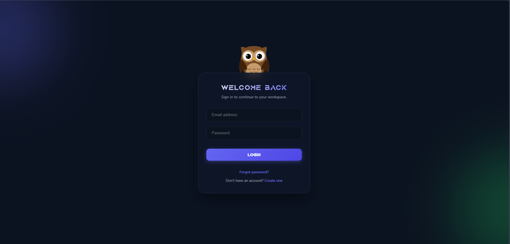
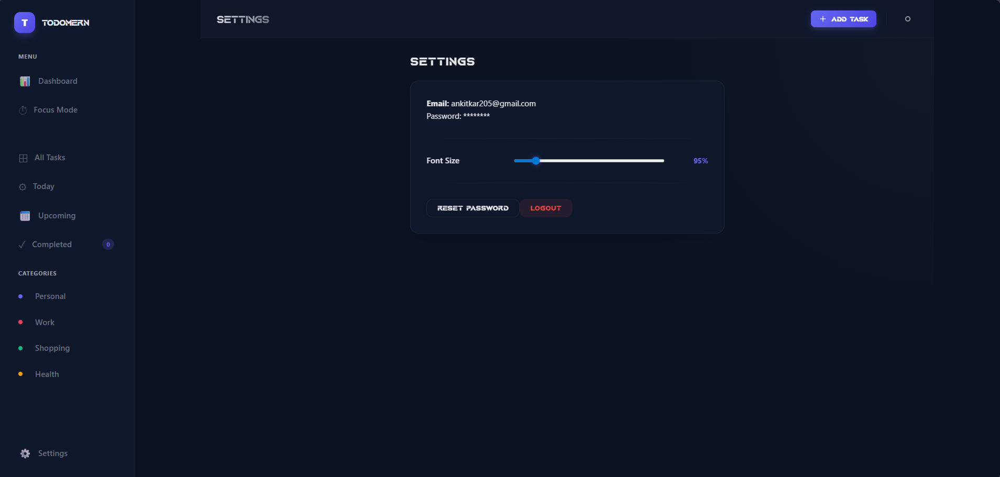
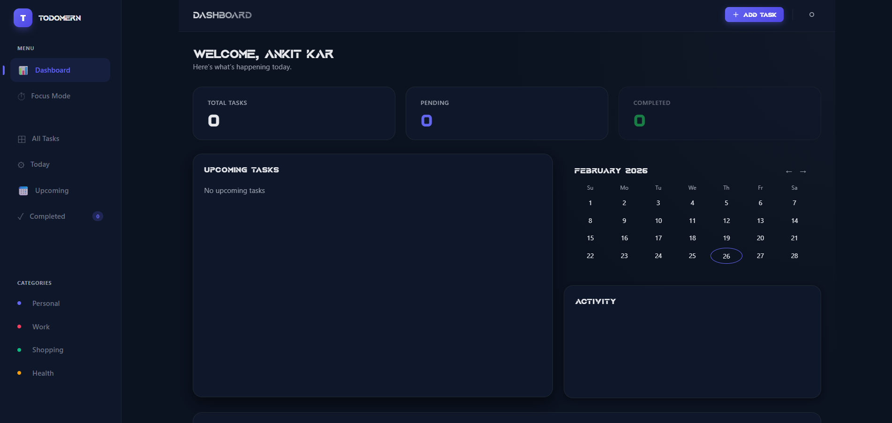
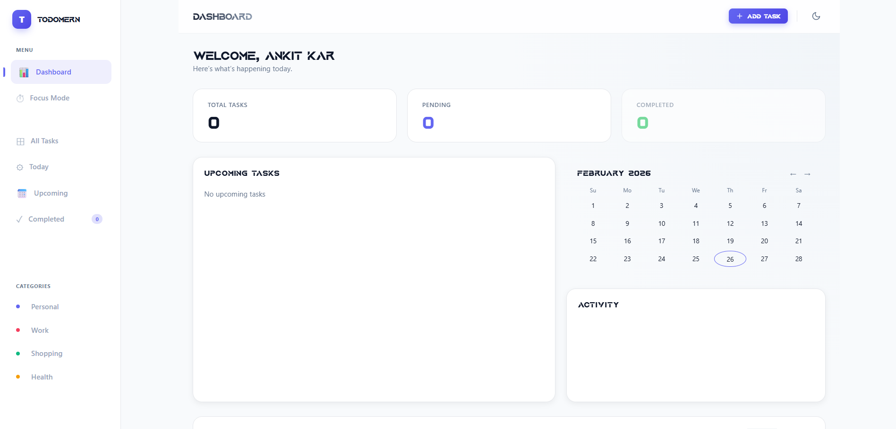
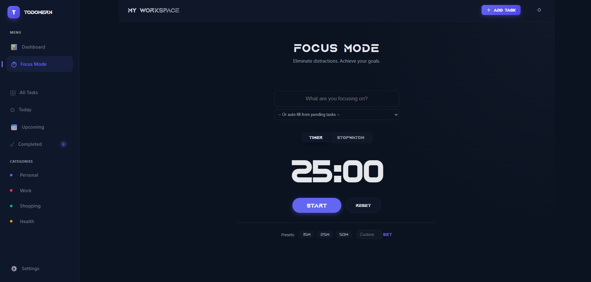
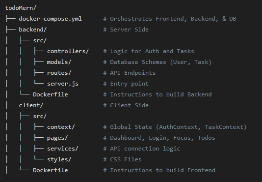

# 🚀 TodoMERN - Advanced Productivity Workspace


## 📖 Project Overview
**TodoMERN** is a full-stack, containerized task management system. It goes beyond a basic To-Do list by offering a complete productivity workspace. It features secure Authentication, advanced Data Visualization, a Pomodoro Focus Timer, and a modern Glassmorphism UI. 

This project was built to demonstrate proficiency in **Frontend Development (React/Vite)**, **Backend API Design (Node/Express)**, **Database Management (MongoDB)**, and **DevOps (Docker)**.

---
## 📸 Project Gallery

| 🦉 Secure Login (Interactive Owl) | ⚙️ Settings (Dynamic Scaling) |
| :---: | :---: |
|  |  |

| 🌙 Smart Dashboard (Dark Mode) | ☀️ Smart Dashboard (Light Mode) |
| :---: | :---: |
|  |  |

<br>

<div align="center">
  <h3>⏱️ Focus Mode (Pomodoro & Stopwatch)</h3>
  
</div>

---

## ✨ Features

### 🔐 1. Secure Authentication
* **JWT (JSON Web Tokens):** Passwords are encrypted using `bcryptjs` and users are authenticated via secure tokens.
* **Interactive UI:** Features a custom "Deal With It" Owl animation that reacts dynamically when the user focuses on the password field.

### ✅ 2. Advanced Task Management (CRUD)
* Create, Read, Update, and Delete tasks instantly with **Optimistic UI Updates**.
* Categorize tasks (Work, Personal, Health, Shopping) and set Priorities (Low, Medium, High, Urgent).
* Toggle task statuses between `Pending`, `In Progress`, and `Completed`.

### 📊 3. Smart Dashboard & Analytics
* **Real-time Stats:** Visual counters for Total, Pending, and Completed tasks.
* **Activity Graph:** An SVG-based graph mapping task completion over the last 7 days.
* **Mini-Calendar:** Highlights dates that have pending tasks due.

### ⏱️ 4. Focus Mode (Pomodoro)
* **Custom Timer & Stopwatch:** Built-in tools for deep work sessions.
* **Goal Setting:** Users can select a pending task from their database to focus on.
* **Audio Feedback:** Triggers an alarm when the session is complete.

---

## 🛠️ Tech Stack & Architecture

| Component | Technology | Description |
| :--- | :--- | :--- |
| **Frontend** | React + Vite | Fast, component-based UI |
| **Backend** | Node.js + Express | REST API and Server logic |
| **Database** | MongoDB | NoSQL Database for storing tasks/users |
| **State** | Context API | Global state management (Auth & Tasks) |
| **DevOps** | Docker | Containerization & Orchestration |
| **Styling** | CSS Modules | Custom Glassmorphism & Animations |

**Data Flow Architecture:**
`Client (React)` ➔ `Fetch API (api.js)` ➔ `Express Router` ➔ `Controller Logic` ➔ `MongoDB`

---
## 📁 Project Structure



---

## 🐳 How to Run (Recommended: The Docker Way)

We used **Docker** to ensure the app runs flawlessly on any machine without needing to install Node.js or MongoDB locally. 

### Prerequisites
* Install [Docker Desktop](https://www.docker.com/products/docker-desktop/). Ensure it is running.

### Steps
1. **Clone the repository:**
   ```bash
   git clone <your-github-repo-link>
   cd todoMern
---
### Team Members
1. Ankit Kar
2. Hritabrata Ghosh
3. Priyanshu Das
